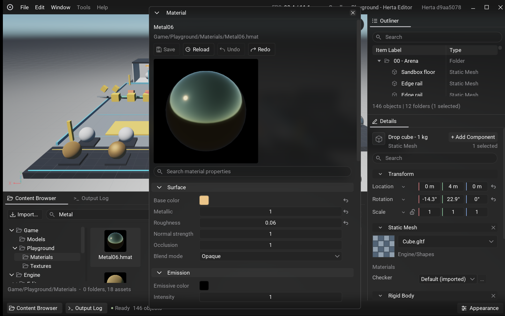

# Milestone 4.5 completion report

## Delivered

- Editable, canonical `.hmat` assets with independent mesh-slot overrides, six PBR texture slots, explicit color spaces and packed channels, normal strength, UV transforms, emission, and alpha masking. glTF defaults remain editable; normals and tangents are cooked rather than reconstructed from position in the shader.
- A dockable material editor with a cooked sphere, HDR/PBR/SMAA preview, property search, reset arrows, independent undo/redo, save/reload, and Save/Discard/Cancel guards. Draft changes do not write source files. Successful shader publication refreshes cached previews without recooking material textures.
- Asynchronous Slang source/include watching through the existing worker. Compatible stock and project shader pipelines publish atomically. Invalid edits retain the last working pipelines and show diagnostics. Preview and viewport share the published GPU pipelines.
- Authored Directional, Sky, Point, Spot, and Rect lights, with typed units, temperature/color controls, selection guides, component editing, transactions, and persistence. HDR scene color, manual exposure, tone mapping, diffuse irradiance, and GGX-prefiltered environment lighting belong to the runtime renderer.
- Directional cascades, point/spot shadows, area-shaped Rect lighting, linked-sun atmosphere, HDR environment-map skies, height fog, depth-aware volumetric fog with light/shadow integration, and reference SMAA 1x with Off and four quality presets.
- Sandbox expanded to 146 entities in 12 folders, with 23 editable materials, four texture-map fixtures, a shared sphere, and visual comparison stations. The original 63 entities, eight folders, and all 16 dynamic-body settings are preserved.

Existing asset, worker, renderer, transaction, and UI paths were extended. SMAA's pinned reference source and lookup textures are the only new dependency. There is no parallel editor-only renderer or new shader/compiler service.

## Visual and runtime checks

Windows screenshots were inspected for playground framing, materials, the Content Browser, and material-editor geometry. The material window's initial narrow size was found through live capture and corrected. Its preview was upgraded from a flat cube to the shared sphere and the runtime HDR pipeline.

Native interaction checks changed roughness from 0.06 to 0.7, confirmed the dirty indicator and preview update, opened Save/Discard/Cancel on close, canceled with Escape, and undid back to the saved value without writing the material source.

Linux X11 and Wayland screenshots were inspected. Both loaded the same gallery, textures, masked geometry, lighting bays, sky, and fog. Native GPU readback checks exercise PBR, every direct light type, shadows, sky, environment lighting, fog, SMAA, indexed instancing, resize, cancellation, and resource retirement. Validation reported no Vulkan warnings or errors in the successful runs.

| Verification | Result |
| --- | --- |
| Windows ClangCL Development, all projects | Zero build warnings/errors; 560 tests and 260,269 assertions passed |
| Windows MSVC v145 Development, all projects | Zero build warnings/errors; 560 tests and 260,269 assertions passed |
| Linux GCC 16.2.1 Development, all targets | Clean build; 562 tests and 260,271 assertions passed |
| Cppcheck, all 13 touched C++ modules | Passed using their Development project configurations |
| Windows/Linux packaging regressions | 25 Windows tests and 147 Linux checks passed; all 18 required cooked shaders and sphere content included |
| Windows ClangCL Shipping build and extracted archive | Zero build warnings/errors; 600 asset-ready frames and all 23 materials loaded outside the checkout without errors/warnings or shader sources/compiler worker |
| Actual Linux Development archive | Packaged worker cooked plain, textured, masked materials and Sphere from scratch without Engine/Shaders, compiler worker, SDK, or External; assets/level validation passed |
| Windows NVIDIA native renderer and 600-ready-frame playground | Passed, no Vulkan warnings/errors |
| Linux X11 and Wayland native renderer and playground | Passed under WSL Mesa lavapipe, no Vulkan warnings/errors |

The opt-in EnTT adoption benchmark is skipped on both platforms; Linux also skips a helper-only nested-process test entry. Linux Cppcheck is unavailable; the Windows project checks cover every touched module. Linux Shipping was not rebuilt locally; its archive changes were checked through packaging regressions and an actual Development package. The bounded Windows renderer smoke logs a 21 ms shader-worker shutdown wait after completing its checks; the normal 600-frame capture exits without warnings.

The extracted archive check exposed and fixed a stock-material cook dependency on the absent shader-source directory. A worker regression now covers missing optional roots, textured stock materials, unchanged cache keys, and rejection of genuinely missing texture/include dependencies. Shipping shader iteration is explicitly disabled.

## Measured budgets

Windows Development, NVIDIA RTX 4090 Laptop GPU, 1977x1123 playground viewport, -14 EV, Soft shadows, SMAA High:

| Runtime pass | Latest completed GPU time |
| --- | ---: |
| Shadow maps | 1.746 ms |
| PBR meshes | 0.638 ms |
| Sky | 0.043 ms |
| Volumetric fog and composite | 0.520 ms |
| Tone mapping | 0.023 ms |
| SMAA, three passes | 0.126 ms |
| Total of these passes | 3.196 ms |

These are timestamp-query samples from a bounded native capture, not a median benchmark or total editor frame time. Viewport render targets consumed 97,816,132 bytes (93.3 MiB); this excludes mesh/texture assets, thumbnail targets, swapchain, UI, and driver allocations. Environment filtering took 13.896 ms on a worker, GPU upload submission took 1.206 ms on the CPU, and its filtered textures occupied 185,696 bytes.

At 1280x726, Linux captures reported 50,697,216 bytes (48.3 MiB) of viewport targets and executed every visual pass. Linux used Mesa lavapipe under WSL, so its software-rendering timings do not establish Linux hardware performance. X11 and Wayland are functional/validation checks, not comparable GPU benchmarks.

## Explicit limits

- 32 enabled lights and 16 shadow views in a 4096x5120 atlas: one directional light with four 2048 px cascades and 512 px local tiles. The playground uses 12 views. Over-budget lights/shadows degrade predictably and expose their limits in Rendering settings.
- Rect shading integrates an area emitter; its shadow is a single center-emitter approximation. This is not soft area-shadow tracing or dynamic GI.
- Ray-marched single-scattering atmosphere and filtered sky lighting, not a full multi-scattering atmospheric LUT system. No clouds, weather, baked lighting, or emissive-surface GI.
- Fog is quarter-resolution, capped at 512 px per dimension, with 16/32/64 ray steps. Depth-aware compositing avoids opaque-surface bleed. There is no temporal history; camera cuts and resize need no accumulation reset. Fine shafts can retain sampling noise/banding.
- SMAA 1x is spatial. It does not eliminate temporal/subpixel shimmer, specular aliasing, or thin-detail instability during motion. Temporal AA and raster scaling remain Milestone 6.
- Opaque and masked materials only. Custom shaders must follow the supported visual uniform and binding contract. HDR texture bindings must be Linear. Shader iteration is disabled in the experimental Shipping editor, where custom-shader materials fall back to engine PBR; portable custom-shader deployment remains part of Milestone 5's cooking/deployment slice.
- `HertaGame`, a controllable player, isolated editor Play/Stop, and standalone deployment remain Milestone 5. Large-fixture Linux hardware performance is not claimed.

## Reproduce

Run the platform's build and tests from [Getting started](GettingStarted.md). `HertaEditor --renderer-test --validation` performs native rendering/readback checks. `HertaEditor --visual-test --validation` renders 600 asset-ready frames from the normal Sandbox camera, logs pass timings and target memory, saves a viewport image for the start view and each camera bookmark under `Saved/VisualTest`, and leaves saved editor preferences untouched.

See [Materials](Materials.md), [Rendering](Rendering.md), and [Sandbox playground](Playground.md) for authoring controls, shader contracts, and feature stations.
