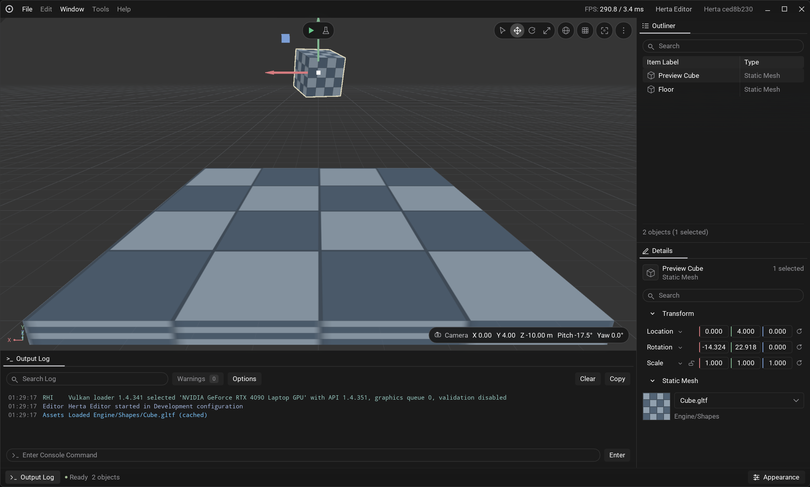

# Herta

A C++23 game engine for Windows and Linux, built around Vulkan. Inspired by Unreal Engine, with a modular architecture.

Herta is a learning project in active development, not a production-ready engine. The editor supports projects, a Content Browser, scene hierarchies and component authoring with undo/redo, asset import and live reimport, and a basic Jolt Physics simulation. The game runtime is not implemented yet.



## Getting started

To try Herta without building, download an experimental Windows or Linux Shipping artifact from a successful [CI run](https://github.com/Solessfir/Herta/actions/workflows/ci.yml) on `main`. See [running a prebuilt editor](Docs/GettingStarted.md#prebuilt-editor) for requirements and launch paths.

Clone the repository:

```sh
git clone https://github.com/Solessfir/Herta.git
```

Setup initializes submodules and downloads the pinned build tools and Vulkan SDK. A Vulkan-capable GPU and driver are required.

### Windows

Install Git and Visual Studio 2026 or 2022 with **Desktop development with C++**, then run:

```bat
Setup.bat
GenerateProjectFiles.bat
```

Open the generated `Herta.slnx` or `Herta.sln` in Visual Studio or Rider, select **Development | x64**, and build and run **HertaEditor**.

### Linux

Install a C++23 toolchain and X11/Wayland development packages. See [Getting started](Docs/GettingStarted.md#linux) for prerequisites.

```sh
./Setup.sh
./GenerateProjectFiles.sh
make --directory=Intermediate/ProjectFiles/gmake --jobs=2 config=development HertaEditor
./Binaries/linux/x86_64/Development/HertaEditor
```

## Documentation

- [Getting started](Docs/GettingStarted.md) - prerequisites, command-line builds, validation, tests, and cleanup.
- [Editor guide](Docs/EditorGuide.md) - controls, selection, simulation, assets, and the Output Log.
- [Projects](Docs/Projects.md) - project creation, loading, and C++ module builds.
- [Engine design](Docs/EngineDesign.md) - architecture and roadmap.
- [Asset pipeline](Docs/AssetPipeline.md) - import, cooking, and asset formats.
- [Rendering](Docs/Rendering.md), [scaling tests](Docs/Scaling.md), and [editor style](Docs/EditorStyle.md) - implementation details.

## License

[MIT](LICENSE). Third-party dependencies retain their own licenses.
